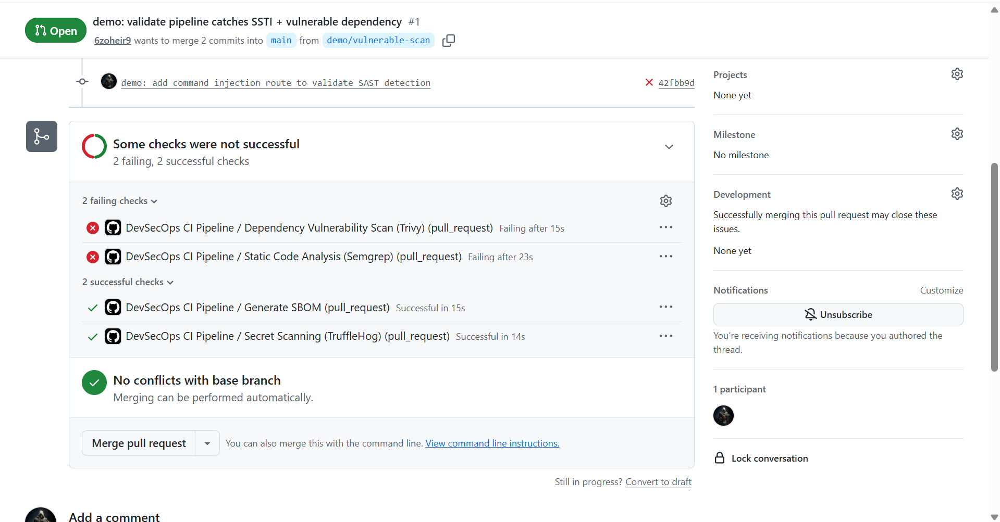
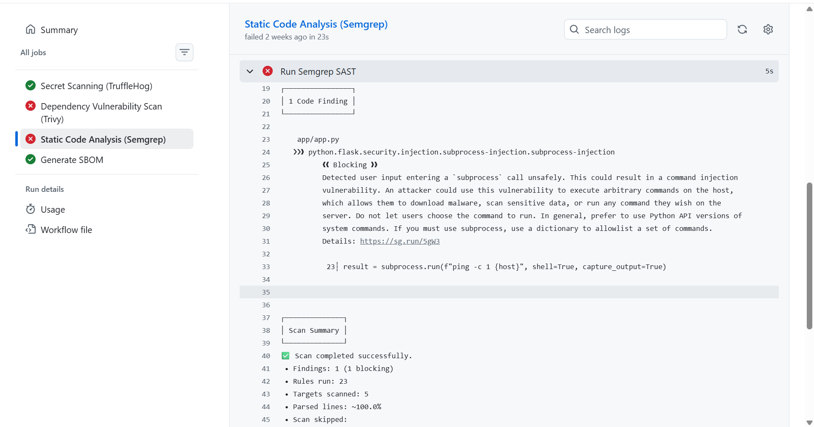
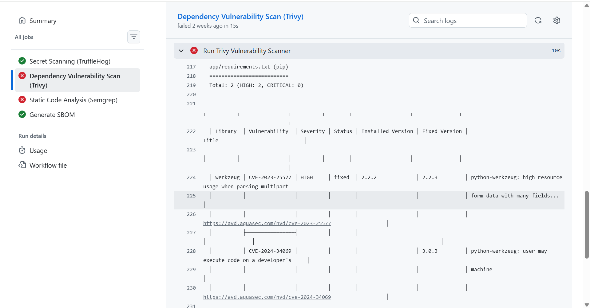
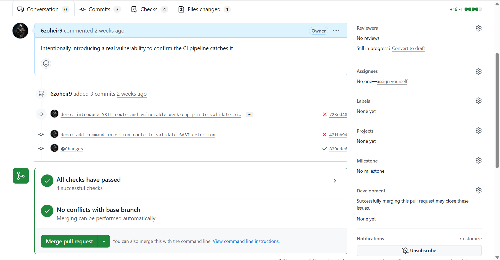

[](https://github.com/6zoheir9/security-pipeline-lab/actions/workflows/ci.yml)

# security-pipeline-lab

A GitHub Actions CI/CD pipeline that runs static analysis, dependency scanning, secret detection, and SBOM generation on every push and pull request.

## Overview

This repository implements a security-gated CI pipeline for a minimal Flask application. Four jobs run in parallel on each push/PR against `main` or `master`:

| Job | Tool | Purpose |
|---|---|---|
| `secret-scan` | TruffleHog | Detects verified, leaked credentials in the diff |
| `sca-scan` | Trivy | Scans `requirements.txt` for known CVEs (HIGH/CRITICAL fails the build) |
| `sast-scan` | Semgrep (`p/ci` ruleset) | Static analysis for vulnerable code patterns |
| `sbom-generate` | Trivy | Generates an SPDX-format Software Bill of Materials |

Workflow definition: [`.github/workflows/ci.yml`](.github/workflows/ci.yml)

## Architecture

```
push / pull_request → main
        │
        ├── secret-scan
        ├── sca-scan
        ├── sast-scan
        └── sbom-generate
```

All four jobs are expected to pass before a PR is merged. Branch protection enforcement is tracked in Roadmap below.

The application in `app/` is a minimal Flask app used as a scan target. It is not a production application.

## Validation

Two vulnerabilities were deliberately introduced on a branch ([PR #1](https://github.com/6zoheir9/security-pipeline-lab/pull/1)) to confirm each scanner detects real issues rather than only passing on clean input.

### Findings

| Scanner | Finding | Severity | File |
|---|---|---|---|
| Semgrep | `python.flask.security.injection.subprocess-injection.subprocess-injection` — unsanitized input passed to `subprocess.run(shell=True)` | Blocking | `app/app.py` |
| Trivy | CVE-2023-25577 — Werkzeug high resource usage parsing multipart form data | HIGH | `app/requirements.txt` |
| Trivy | CVE-2024-34069 — Werkzeug arbitrary code execution via debugger | HIGH | `app/requirements.txt` |

### Screenshots

PR checks before fix — `sast-scan` and `sca-scan` failing, `secret-scan` and `sbom-generate` passing:



Semgrep finding detail:



Trivy finding detail:



PR checks after the fix commit:



### Ruleset coverage note

An earlier SSTI (server-side template injection) test case, built via string concatenation into a Jinja template, was not flagged by `sast-scan`. The relevant rule (`python.flask.security.audit.render-template-string...`) is categorized as `audit`-level in Semgrep and is excluded from the `p/ci` ruleset, which is tuned for a low false-positive rate suitable for CI gating. The command-injection case above was used instead as a higher-confidence detection path.

## Dependency and Action Pinning

- Docker base image pinned by digest (`python:3.11-slim@sha256:...`)
- Container runs as a non-root user
- All GitHub Actions pinned to commit SHAs rather than mutable tags (`actions/checkout`, `trufflesecurity/trufflehog`, `aquasecurity/trivy-action`)

`aquasecurity/trivy-action` was affected by CVE-2026-33634 (March 2026), in which compromised maintainer credentials were used to force-push malicious commits into 76 of 77 version tags in that repository. This pipeline previously referenced `aquasecurity/trivy-action@master`; it is now pinned to commit `57a97c7` (`v0.35.0`), confirmed by Aqua Security as unaffected by the incident.

Pinning the TruffleHog action to a commit SHA does not pin the underlying scanner binary — the Docker image it pulls at runtime defaults to a `:latest` tag unless the `version` input is set explicitly. Flagged for periodic review.

## Local Usage

```bash
docker build -t security-pipeline-lab .
docker run -p 5000:5000 security-pipeline-lab

# Run scanners locally (mirrors CI)
pip install semgrep
semgrep scan --config p/ci

docker run --rm -v $(pwd):/app aquasec/trivy fs /app
```

## Roadmap

- [x] Validate detection with real, deliberately introduced vulnerabilities
- [x] Pin `actions/checkout` consistently across all jobs
- [x] Pin `trufflehog` and `trivy-action` to fixed commits
- [ ] Pin the Semgrep container image (`semgrep/semgrep`, currently unpinned/`:latest`)
- [ ] Enforce this workflow as a required status check in branch protection
- [ ] Feed findings into an automated triage layer